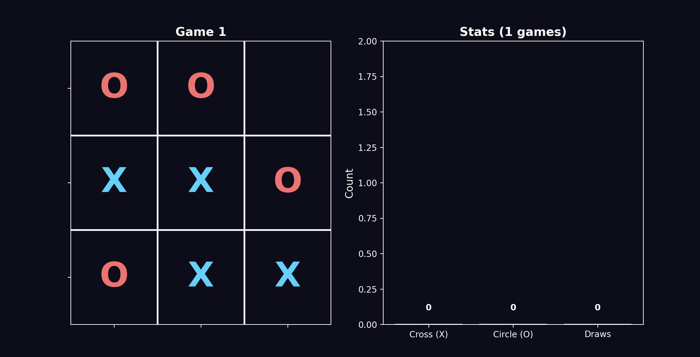

# MCTS Tic-Tac-Toe

A from-scratch implementation of Monte Carlo Tree Search for Tic Tac Toe. Two AI agents play against each other using MCTS with UCB1 selection, or you can play against the AI yourself. Built entirely with NumPy and Python standard library — no ML frameworks.



## How It Works

### Monte Carlo Tree Search (MCTS)

MCTS builds a search tree by running thousands of random simulations, then uses statistics to pick the best move. Four steps per iteration:

1. **Select** — Walk down the tree using UCB1 formula, balancing exploration vs exploitation
2. **Expand** — Add one unexplored move as a new child node
3. **Simulate** — Play randomly from that node to a terminal state
4. **Backpropagate** — Update all ancestors with the result (win/loss)

### UCB1 Selection

```
UCB1 = wins/visits + C × √(ln(parent_visits) / visits) - penalty × losses
```

- Higher `C` = more exploration (tries more moves)
- Lower `C` = more exploitation (focuses on known-good moves)
- Loss penalty discourages moves that lead to opponent wins

### Key Design Decisions

| Feature | Implementation |
|---------|---------------|
| State representation | Dict `{(row, col): 0/1/2}` |
| Turn tracking | Stored per-node (not passed through functions) |
| Exploration constant | C=20 with loss penalty for aggressive pruning |
| Iterations per move | 5000 |
| Backpropagation | From current player's perspective (not global) |

## Project Structure

```
├── main.py                    # MCTS implementation + AI vs AI gameplay
├── main_play_vs_ai.py         # Human vs AI gameplay
├── main_animated.py           # Animated AI vs AI with live stats
└── README.md
```

## Usage

### AI vs AI (console)

```bash
python main.py
```

### Human vs AI

```bash
python main_play_vs_ai.py
```

Enter moves as `row,col` (0-2). Example: `1,1` for center.

### Animated AI vs AI with Stats

```bash
python main_animated.py
```

Shows a live board on the left and win/draw counter on the right across 50 games.

## Results

With 5000 iterations and C=30, both AIs play near-perfectly. Typical results over 50 games:

```
Cross wins:  1-3
Circle wins: 1-3
Draws:       46-48
```

Tic Tac Toe is a solved game — perfect play from both sides always results in a draw. The occasional wins come from variance in the random simulations.

## Lessons Learned

### The Turn Tracking Bug

The hardest bug: `turn` was passed as a function argument but not stored per-node. During simulation, `expand()` always used the root's turn, so Circle's moves were evaluated as if Cross made them. Fix: store `turn` in each `Node` and compute `next_turn = 3 - node.turn` during expansion.

### Exploration vs Exploitation

- `C=2` (standard UCB1): Too exploitative for Tic Tac Toe — tunnel-visions on early lucky wins
- `C=40`: Too exploratory — misses obvious blocking moves
- `C=30` with loss penalty: Good balance for near-perfect play

### Loss Penalty

Adding a `loss` counter separate from `wins` improved play quality. Without it, a move that wins 50% and loses 50% looks the same as a move that wins 50% and draws 50%. The loss penalty distinguishes them.

## Dependencies

```bash
pip install numpy matplotlib
```

Matplotlib is only needed for the animated visualization. Core MCTS uses only NumPy.
